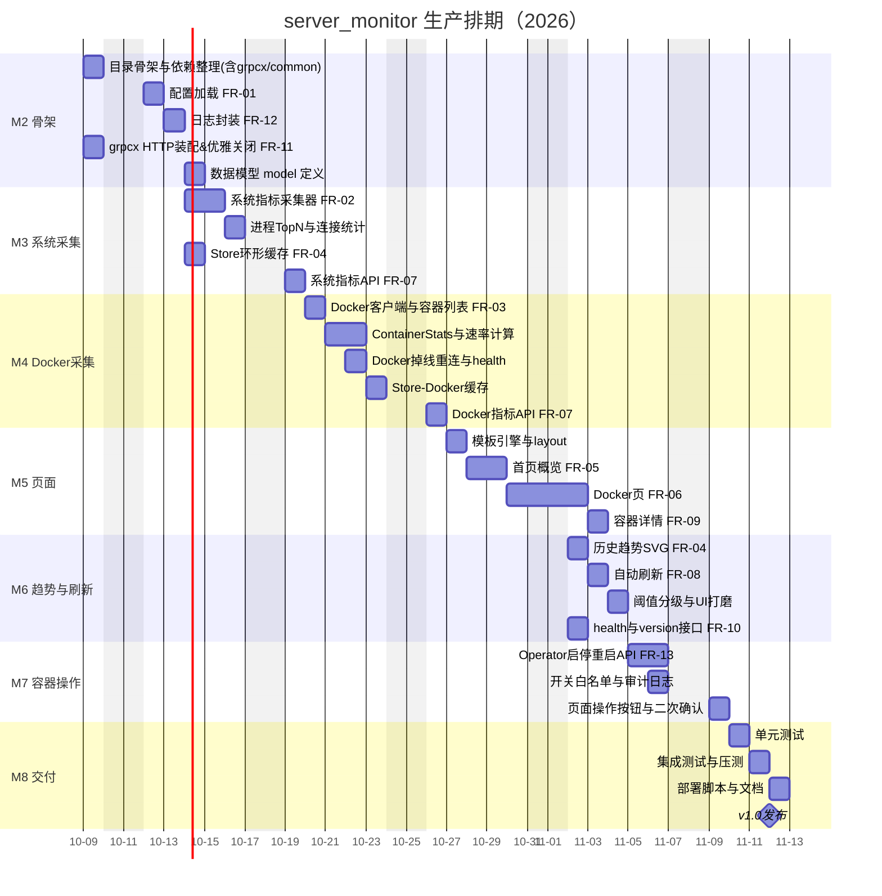

# 服务器运行指标监控服务 · 生产排期计划

| 项目名称 | server_monitor（服务器运行指标监控服务） |
| --- | --- |
| 关联文档 | [需求说明书](./需求说明书.md) |
| 计划版本 | v1.0 |
| 编制日期 | 2026-10-08 |
| 需求基线 | 需求说明书 v1.1（新增 FR-13 容器启停/重启） |
| 排期口径 | 工作日（周一至周五，法定节假日未计入，需按实际调休修正） |

---

## 一、排期总览

- **需求基线（D0）**：2026-10-08（需求说明书评审定稿）。
- **开发启动（D+1）**：2026-10-09。
- **计划完成（D+25）**：2026-11-12（v1.0 发布）。
- **总工期**：25 个工作日（约 1 个月 + 2 个工作日），包含新增的 M7 容器启停/重启功能（FR-13）。
- **人力配置**：研发 2 人（R1 主力 Go / R2 Go + 模板 + 部署），测试 1 人（Q，可兼职），合计约 2.5 FTE。

### 里程碑一览

| 里程碑 | 内容 | 需求工期 | 计划开始 | 计划完成 | 交付物 | 关联功能 |
| --- | --- | --- | --- | --- | --- | --- |
| M1 | 需求评审 & 技术选型确认 | D0 | 2026-10-08 | 2026-10-08 | 需求说明书定稿 | — |
| M2 | 项目骨架 & 配置 & 日志 | D+3 | 2026-10-09 | 2026-10-13 | 可启动的空服务 | FR-01/FR-11/FR-12 |
| M3 | 系统指标采集 & API | D+7 | 2026-10-14 | 2026-10-19 | `/api/metrics/system` 可用 | FR-02/FR-04/FR-07 |
| M4 | Docker 指标采集 & API | D+12 | 2026-10-20 | 2026-10-26 | `/api/metrics/docker` 可用 | FR-03/FR-04/FR-07 |
| M5 | HTML 模板页面（首页 + Docker 页） | D+16 | 2026-10-27 | 2026-10-30 | Web 可视化上线 | FR-05/FR-06/FR-09 |
| M6 | 历史缓存 & 趋势图 & 自动刷新 | D+19 | 2026-11-02 | 2026-11-04 | 完整监控功能 | FR-04/FR-08/FR-10 |
| M7 | 容器启停/重启操作 | D+22 | 2026-11-05 | 2026-11-09 | 页面可操作容器 | FR-13 |
| M8 | 测试、文档、部署脚本 | D+25 | 2026-11-10 | 2026-11-12 | v1.0 发布 | 全量 + NFR |

---

## 二、甘特图



> 说明：甘特按工作日推进（`excludes weekends`），跳过周末 10-11、10-18、10-25、11-01、11-07、11-08 及跨周末的 10-31。

---

## 三、详细任务分解（WBS）

### M2 项目骨架 & 配置 & 日志（2026-10-09 ~ 10-13，3 人日窗口）

| 任务 | 描述 | 负责人 | 人日 | 依赖 | 交付物 |
| --- | --- | --- | --- | --- | --- |
| 2.1 目录骨架 & 依赖整理 | 按需求说明书 6.2 建目录；`go get` grpcx/common/gopsutil/docker/yaml | R1 | 0.5 | — | 可编译工程骨架、go.mod |
| 2.2 配置加载（FR-01） | YAML + `SMS_` 环境变量覆盖；config.example.yaml | R1 | 1.0 | 2.1 | config 包 + 加载测试 |
| 2.3 日志封装（FR-12） | logrus 初始化，级别/格式配置 | R1 | 0.5 | 2.2 | 日志工具 |
| 2.4 HTTP 服务装配（FR-11） | grpcx.WithHTTPServer 挂载；优雅关闭 signal | R2 | 1.0 | 2.1 | 可启动空服务 + /ping |
| 2.5 数据模型定义 | SystemSnapshot / DockerSnapshot / 子结构 | R1 | 0.5 | 2.1 | model 包 |

> 退出标准：`make run` 可启动，访问首页占位返回 200，SIGTERM 优雅退出。

### M3 系统指标采集 & API（2026-10-14 ~ 10-19，4 人日窗口）

| 任务 | 描述 | 负责人 | 人日 | 依赖 | 交付物 |
| --- | --- | --- | --- | --- | --- |
| 3.1 系统采集器（FR-02） | gopsutil 采集 CPU/内存/磁盘/网络/负载/系统信息 | R1 | 2.0 | 2.5 | SystemCollector |
| 3.2 进程与连接统计 | TopN CPU/内存进程、TCP 连接统计 | R1 | 1.0 | 3.1 | 采集补全 |
| 3.3 Store 环形缓存（FR-04） | 通用 Ring Buffer，保留 history_size 条 | R2 | 0.5 | 2.5 | store 包 |
| 3.4 系统指标 API（FR-07） | `/api/metrics/system`、`/history`，common.Response | R2 | 0.5 | 3.1,3.3 | JSON 接口 |

> 退出标准：`/api/metrics/system` 返回完整快照，采集周期与超时生效。

### M4 Docker 指标采集 & API（2026-10-20 ~ 10-26，5 人日窗口）

| 任务 | 描述 | 负责人 | 人日 | 依赖 | 交付物 |
| --- | --- | --- | --- | --- | --- |
| 4.1 Docker 客户端（FR-03） | client 封装、ContainerList | R2 | 1.0 | 2.5 | DockerCollector 骨架 |
| 4.2 Stats 采集与速率计算 | ContainerStats stream，RX/TX/IO 速率差分 | R2 | 2.0 | 4.1 | 完整容器指标 |
| 4.3 掉线重连与状态 | socket 不可用时降级 + 重连 | R1 | 1.0 | 4.1 | 容错逻辑 |
| 4.4 Store-Docker 缓存 | 复用 Ring Buffer 存 DockerSnapshot | R2 | 0.5 | 3.3,4.2 | 缓存实例 |
| 4.5 Docker API（FR-07） | `/api/metrics/docker`、`/{containerId}` | R2 | 0.5 | 4.2,4.4 | JSON 接口 |

> 退出标准：`/api/metrics/docker` 返回全部运行容器指标；停 Docker 不影响服务。

### M5 HTML 模板页面（2026-10-27 ~ 10-30，4 人日窗口）

| 任务 | 描述 | 负责人 | 人日 | 依赖 | 交付物 |
| --- | --- | --- | --- | --- | --- |
| 5.1 模板引擎 & layout | gin 加载 templates，公共布局 | R2 | 0.5 | 3.4 | layout.html |
| 5.2 首页概览（FR-05） | 卡片 + 网络/磁盘 + TopN 进程 | R1+R2 | 1.5 | 3.1,5.1 | index.html |
| 5.3 Docker 页（FR-06） | 列表 + 排序 + 状态过滤 | R2 | 1.5 | 4.2,5.1 | docker.html |
| 5.4 容器详情（FR-09） | Stats/Env/Mounts/Ports | R2 | 0.5 | 4.5 | docker_detail.html |

> 退出标准：浏览器访问 `/`、`/docker`、`/docker/{id}` 正常渲染。

### M6 历史缓存 & 趋势图 & 自动刷新（2026-11-02 ~ 11-04，3 人日窗口）

| 任务 | 描述 | 负责人 | 人日 | 依赖 | 交付物 |
| --- | --- | --- | --- | --- | --- |
| 6.1 趋势曲线（FR-04） | 历史切片渲染内联 SVG 迷你曲线 | R1 | 1.0 | 3.3,5.2 | 趋势图 |
| 6.2 自动刷新（FR-08） | refresh_interval 注入 JS，`?refresh=0` 关闭 | R2 | 0.5 | 5.2 | 刷新逻辑 |
| 6.3 阈值分级 & UI 打磨 | 4.3 阈值配色（ok/warn/danger） | R2 | 1.0 | 5.2,5.3 | 样式完善 |
| 6.4 健康与版本接口（FR-10） | `/api/health`、`/api/version` | R1 | 0.5 | 3.1,4.2 | 接口 |

> 退出标准：功能全集可演示，健康检查反映采集器与 Docker 状态。

### M7 容器启停/重启操作（2026-11-05 ~ 11-09，3 人日窗口）

| 任务 | 描述 | 负责人 | 人日 | 依赖 | 交付物 |
| --- | --- | --- | --- | --- | --- |
| 7.1 Operator 封装（FR-13） | ContainerStart/Stop/Restart；幂等与错误映射 | R2 | 1.0 | 4.1 | DockerOperator |
| 7.2 开关/白名单/审计 | docker.operations.enabled + allow_labels/deny_names + 审计日志 | R1 | 0.5 | 2.2,2.3 | 安全控制 |
| 7.3 操作 API | POST `/api/docker/{id}/start|stop|restart`，common.Response | R2 | 0.5 | 7.1 | JSON 写接口 |
| 7.4 页面操作与确认 | Docker 页/详情页按钮 + 二次确认 + loading + 刷新 | R2 | 1.0 | 5.3,5.4,7.3 | HTML/JS |

> 退出标准：启用开关后可从页面启停/重启容器；未启用时接口返回 403；操作写入审计日志。

### M8 测试、文档、部署脚本（2026-11-10 ~ 11-12，3 人日窗口）

| 任务 | 描述 | 负责人 | 人日 | 依赖 | 交付物 |
| --- | --- | --- | --- | --- | --- |
| 8.1 单元测试 | 采集解析、Store 边界、阈值映射、Operator mock | R1 | 1.0 | M7 | 测试用例 + 覆盖率报告 |
| 8.2 集成测试 & 压测 | `/`、`/docker`、`/api/*`；启停接口；100QPS P95<300ms | Q | 1.0 | M7 | 测试报告 |
| 8.3 部署脚本 & 文档 | Makefile、systemd、README、指标字典 | R2 | 1.0 | M7 | 部署包 + 文档 |
| 8.4 v1.0 发布 | 打 tag、二进制产物、发布说明 | R2 | 0.5 | 8.1~8.3 | release v1.0 |

> 退出标准：NFR-01~NFR-10 验收，v1.0 上线。

---

## 四、关键路径与依赖

**关键路径**：2.1 → 2.5 → 3.1（系统采集）→ 4.1（Docker）→ 7.1（Operator）→ 7.4（页面操作）→ 8.2（压测）→ 8.4（发布）。

- M3、M4 存在共享资源（Store、model），需先完成 M2 的 2.5 数据模型与 3.3 Store。
- M5 页面依赖 M3/M4 的采集数据与 API；建议页面开发与后端接口在 M4 末期部分并行。
- M7 容器操作（FR-13）依赖 M4 的 Docker 客户端与 M5 的 Docker 页；为写操作，安全控制（白名单/审计）不可缺失。
- M4 的 Docker 采集（4.2/4.3）为技术不确定项，是排期主要风险来源，详见第六节缓冲策略。

### 里程碑依赖关系

```
M1(定稿) → M2(骨架) → M3(系统) ─┐
                     M4(Docker) ─┤→ M5(页面) → M6(趋势/刷新) → M7(容器操作) → M8(测试/发布)
                                 ┘   (M7 依赖 M4 客户端与 M5 页面)
```

---

## 五、人力资源投入

| 角色 | 代号 | 主要职责 | 预计投入 |
| --- | --- | --- | --- |
| Go 后端（主力） | R1 | 系统采集、Store、单测、进程统计、安全控制 | ~ 16 人日 |
| Go 后端 + 前端模板 | R2 | HTTP 装配、Docker 采集与操作、页面、部署 | ~ 18 人日 |
| 测试 | Q | 集成测试、压测 | ~ 1 人日 |

> R1/R2 并行推进 M3 与 M4 可压缩总工期约 2 个工作日；若仅 1 人开发，总工期延长至约 38 个工作日。

---

## 六、风险与排期缓冲

| 风险 | 概率 | 影响 | 应对与缓冲 |
| --- | --- | --- | --- |
| Docker Engine API 权限/版本差异 | 中 | M4 延误 1~2 天 | M4 首日先做 4.1 连通性验证，尽早暴露；预留 M4 窗口 5 人日（实际约 4 人日）作缓冲 |
| gopsutil 在目标 Linux 内核指标不准 | 中 | 采集字段缺失 | 3.1 增加真实机器验证；失败字段降级为 unavailable |
| 模板趋势图（内联 SVG）工作量被低估 | 低 | M6 延误 | 6.1 先做折线占位，二期再优化 |
| 人员被其他项目占用 / 单点开发 | 中 | 整体顺延 | 每日站会同步；关键路径任务优先分配 R1 |
| 容器启停为写操作，误停业务（FR-13） | 中 | 高（影响线上） | 默认关闭开关 + 白名单/黑名单 + 二次确认 + 审计日志；测试环境先验证 Operator |
| 节假日调休影响工作日 | 低 | 里程碑错位 | 发布前用日历核对 D+n，必要时顺延 |

**总缓冲**：M4 预留 1 天、M8 预留 0.5 天，累计约 1.5 个工作日项目缓冲（Project Buffer）置于发布前。

---

## 七、交付物清单

| 阶段 | 交付物 |
| --- | --- |
| M2 | 工程骨架、go.mod、config.example.yaml、可启动空服务 |
| M3 | SystemCollector、Store、`/api/metrics/system` |
| M4 | DockerCollector、`/api/metrics/docker`、掉线容错 |
| M5 | 首页 / Docker 页 / 容器详情 HTML |
| M6 | 趋势曲线、自动刷新、阈值配色、health/version |
| M7 | 容器启停/重启（DockerOperator + 操作 API + 页面按钮 + 审计日志） |
| M8 | 测试报告、Makefile、systemd 部署、README、v1.0 二进制 |

---

## 八、验收标准（对齐 NFR）

- 单次系统采集 ≤ 200ms，服务常驻内存 ≤ 100MB（NFR-01）。
- 首页 TTFB ≤ 300ms（NFR-02）。
- 任一采集器异常不影响 Web 与其他采集器（NFR-03）。
- Docker 掉线后可自动重连（NFR-04）。
- 100 QPS 下页面 P95 < 300ms（第九章测试需求）。
- 全部 `/api/*` 使用 `common.Response` 统一格式（code=200 成功）。
- 容器启停/重启（FR-13）：未开启写操作开关时接口返回 403；开启后启停成功并写入审计日志（需求说明书 FR-13）。

---

## 九、进度跟踪机制

- **每日站会**：同步关键路径进度与阻塞项。
- **里程碑评审**：每个 Mx 结束进行 DoD（Definition of Done）验收。
- **燃尽跟踪**：按本文档人日估算在项目管理工具（如 Jira/禅道）建卡，跟踪剩余人日。
- **变更控制**：需求变更需回到需求说明书更新基线，并重新评估 D+n 影响。

---

## 附录：工作日与 D+n 对照

| D+n | 日期 | 星期 | 里程碑 |
| --- | --- | --- | --- |
| D0 | 2026-10-08 | 周四 | M1 |
| D+1 | 2026-10-09 | 周五 | M2 起 |
| D+3 | 2026-10-13 | 周二 | M2 止 |
| D+4 | 2026-10-14 | 周三 | M3 起 |
| D+7 | 2026-10-19 | 周一 | M3 止 |
| D+8 | 2026-10-20 | 周二 | M4 起 |
| D+12 | 2026-10-26 | 周一 | M4 止 |
| D+13 | 2026-10-27 | 周二 | M5 起 |
| D+16 | 2026-10-30 | 周五 | M5 止 |
| D+17 | 2026-11-02 | 周一 | M6 起 |
| D+19 | 2026-11-04 | 周三 | M6 止 |
| D+20 | 2026-11-05 | 周四 | M7 起（容器操作） |
| D+22 | 2026-11-09 | 周一 | M7 止 |
| D+23 | 2026-11-10 | 周二 | M8 起（测试/交付） |
| D+25 | 2026-11-12 | 周四 | M8 止 / v1.0 发布 |

> 注：法定节假日 / 调休未纳入，正式排期请结合公司日历二次校准。
